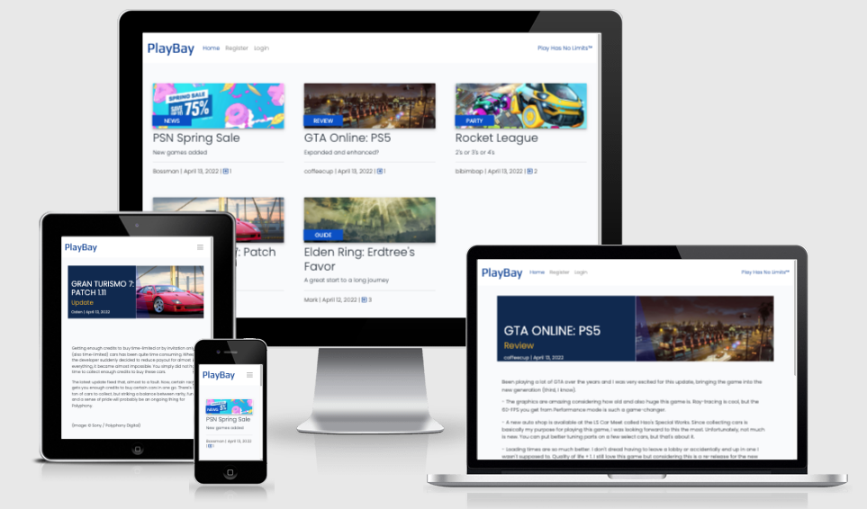
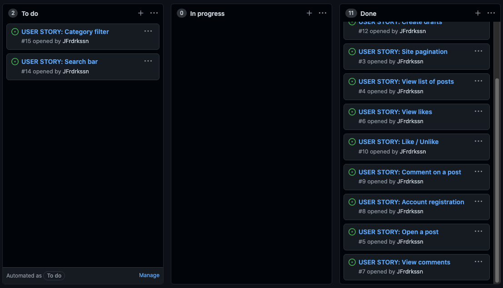
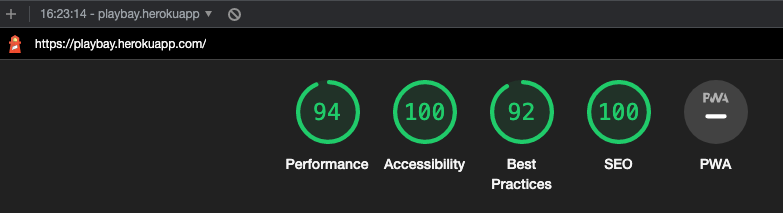

<h1 align="center" style="font-size: 250%;"><b>
PlayBay
</b></h1>

PlayBay is a site centered on the PlayStation® gaming console. 

The purpose of the site is to provide a place where people interested in PlayStation® can read and post entries ranging from news to group plays, interact with other users and act as a hub solely dedicated to the console. 

It is designed to look and feel similar to the PlayStation® 5 brand and console.

Users can register an account to access full CRUD functionality for posting on the site. 

[Check the live project here!](https://playbay.herokuapp.com/)

  

# **User Experience (UX)**

## **User stories**

- ### First visit

  - As a User, I want to intuitively understand what the site is about.

- ### Navigation

  - As a User, I want to intuitively understand how to navigate the site.
  - As a User, I want it to be clear where I am on the site.
  - As a User, I want to be able to search and filter posts based on category.
  - As a User, I want to be able to search for post titles and content.

- ### Registration

  - As a User, I want to be able to register an account so I can further interact with the site.
  - As a User, I want to be able to add profile information about myself.

- ### Site Interaction

  - As a User, I want to be able to post entries.
  - As a User, I want to be able to edit and delete posts created by me.
  - As a User, I want to be able to comment on posts.
  - As a User, I want to be able to like/upvote posts.

- ### Admin

    - As an Admin, I want to be able to manage posts.
    - As an Admin, I want to be able to manage comments.
    - As an Admin, I want to be able to add content specific related content, like categories.

    

## **Design**

- **Color Scheme**

  - A white background coupled with shades of blue, gold and grey provides clear contrast that is also easy on the eyes. It matches the aesthetic profile of the PlayStation® 5 console, giving a clear connection between the two.
  - The navigation bar and footer of the site has a sharper white, providing a very slight contrast to the main contents of the site.
  - Images for posts can be uploaded by a user, therefore the prominent white color coupled mostly with blue helps create a neutral background for images of any composition.
  - Some smaller elements are gold. In the world of PlayStation®, the gold/yellow color scheme is part of a special subscription model, and provide a great contrast to the white and blue colors that are part of the core brand color scheme.

- **Typography**

  - The Play font is used for the site logo. The font has a modern and sleek look while also reminding of the font used by the PlayStation® brand itself.
  - The Poppins font is used everywhere else on the site. It is clear, sleek and provide a good separation between characters, making it easy to read and blending in well.
  - Sans-serif is used as a backup-font.

## **Wireframes**

- [Home](media/wireframes/homewf.png)
- [Post](media/wireframes/postdetailwf.png)
- [Add Post](media/wireframes/addwf.png)
- [Edit Post](media/wireframes/editwf.png)
- [Delete Post](media/wireframes/deletewf.png)
- [Register](media/wireframes/regwf.png)
- [Log in](media/wireframes/linwf.png)
- [Log out](media/wireframes/loutwf.png)

  

# **Agile**

For this project the GitHub Kanban agile project management tool was used for workflow.

  

# **Unfinished Features**

## _These features were never implemented due to time constraint._

- Search and filter - A search bar for listing and filtering specific content.
    

## _These features are planned._

- Profile page
  - A profile page where users can do things like adding profile picture, PlayStation® username and change password.
      
- Nested comment system
  - A system for replying to certain comments and create threads.
      
- Image copyright control
  - A system for checking copyright protected material. A first draft would be to implement an "approved" status on uploaded media, where the admin can check validity.
      
- Image resizing and compression
  - Cloudinary, which is used by the site to store images, has an auto-transform function. This would help resize and compress images to prevent them from being too big and slowing down the site.
      
- Rich text editor - The default text field when adding posts does not provide enough customization. A rich text editor would help format blog post content.
    

# **Data Model**

## ERD

## User Model (AllAuth)

- ID of User is linked via a ForeignKey relation in the Post Model author field.
- ID of User is linked via a ForeignKey relation in the Post Model likes ManyToMAny field.
- ID of User is linked via a ForeignKey relation in the Comment Model user field.

## Post Model

- ID of Post is linked via a ForeignKey relation in the Comment Model post field.

## Database

- SQLite has been used in delevopment to store data.
- PostgreSQL is used in production to store data.
    

# **Technologies**

## **Languages**

- [HTML](https://en.wikipedia.org/wiki/HTML5)
- [CSS](https://en.wikipedia.org/wiki/CSS)
- [JavaScript](https://www.w3schools.com/js/js_es6.asp)
- [Python](https://www.python.org/)

## **Programs**

- [Gitpod](https://gitpod.io)
  - Gitpod was used to host a virtual workspace.
- [Git](https://git-scm.com/)
  - Git was used for version control by utilizing the Gitpod terminal to commit and push to GitHub.
- [GitHub](https://github.com/)
  - GitHub is used to store the projects code after being pushed from Git.
- [Django](https://www.djangoproject.com/)
  - Django was used as the primary framework for building the project.
- [Django Crispy Forms](https://django-crispy-forms.readthedocs.io/en/latest/)
  - Crispy Forms was used to render the comment form on the site.
- [Django AllAuth](https://django-allauth.readthedocs.io/en/latest/index.html)
  - AllAuth was used for user authentication.
- [Bootstrap](https://getbootstrap.com/)
  - Bootstrap was used for styling and responsiveness.
- [Cloudinary](https://cloudinary.com/)
  - Cloudinary is used for image hosting.
- [SQLite](https://www.sqlite.org/index.html)
  - SQLite was used as the database for development.
- [PostgreSQL](https://www.postgresql.org/)
  - PostgreSQL is used as the deployed database.
- [Heroku](https://id.heroku.com/login)
  - Heroku is used to host the application.
- [Gunicorn](https://gunicorn.org/)
  - Gunicorn is used for deploying the project to Heroku.
- [dbdiagram](https://dbdiagram.io/home)
  - dbdiagram was used to create the ERD.
- [Google Fonts](https://fonts.google.com/)
  - Google fonts was used to import the Play and Poppins fonts.
- [Font Awesome](https://fontawesome.com/)
  - Font Awesome was used to style instruction icons.
- [Balsamiq](https://balsamiq.com/)
  - Balsamiq was used to create wireframes for design purposes.
- [Image-Resizer](https://imageresizer.com/)
  - Image-Resizer was used to resize images.
- [TinyPNG](https://tinypng.com/) 
  - TinyPNG was used to compress image files.
    

# **Testing**

The W3C Markup Validator, W3C CSS Validator Services, JSHint and PEP8 were used to validate the site to ensure there were no syntax errors in the project.

- [W3C Markup Validator](https://validator.w3.org/nu/) show no errors.
  - [.html](media/w3cvalidation/htmlvalid.png)
- [W3C CSS Validator](https://jigsaw.w3.org/css-validator/) show no errors.
  - [style.css](media/w3cvalidation/cssvalid.png)
- [PEP8](http://pep8online.com/) show no errors except lines being too long. 
  - [views.py](media/pep8/viewspep.png) 
  - [models.py](media/pep8/modelspep.png) 
  - [forms.py](media/pep8/formspep.png) 
  - [admin.py](media/pep8/adminpep.png) 
  - [urls.py](media/pep8/urlspep.png)
    

Lighthouse

  

## **Testing User Stories from User Experience (UX) Section**

### First Visit

- As a First Time User, I want to intuitively understand what the site is about.
  - When first visiting the site several elements point to the site subject.
    - The name and logo of the site is PlayBay, pointing to the connection with PlayStation®.
    - Posts on the site have an image which looks like the background theme of the PlayStation® console, or images uploaded based on the subject or game connected to the console.
    - Posts on the site have a label corresponding to the particular category of the post. The categories point to regular labels for game sites, like review and news. Party is a particular category linked to the "group chat" function of the console, again connecting it to PlayStation®.
    - The navigation bar has a slogan derived directly from PlayStation®, "Play Has No Limits", which is the slogan used for the current generation PlayStation® console.
  

### Navigation

- As a User, I want to intuitively understand how to navigate the site.
  - The navigation bar links at the top of the site have clear names for what they do. Post+ is the least obvious, but the target audience most likely understands it purpose.
  - The site redirects the user to the correct site based on input. If a user likes a post, the page simply reloads. If a user logs in, it redirects to the home page. If a user edits their post, they are redirected to the edited post.
- As a User, I want it to be clear where I am on the site.
  - The links in the navigation bar does not have an "active" state. Regardless, there are few pages and each one is sufficiently different as to not confuse anyone. Clicking "Login", for example, takes the user to a form, which is obviously not a post.
- As a User, I want to be able to search and filter posts based on category.
  - This not possible right now. It's a planned feature. Since there are only a few posts on the site as of now, this is not an immediate issue.
- As a User, I want to be able to search for post titles and content.
  - Same as above.